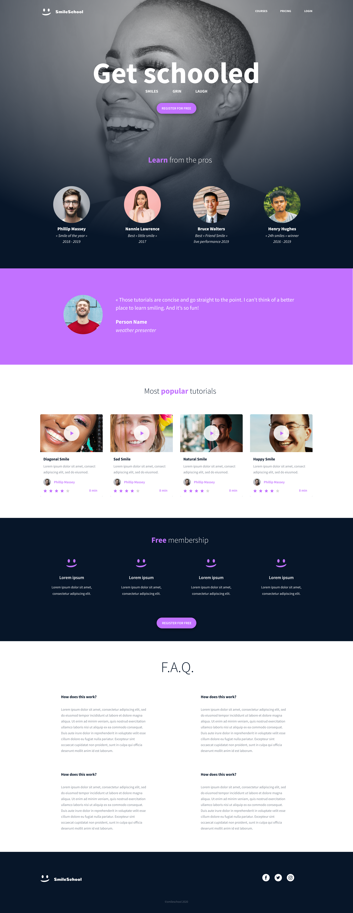

# HTML Advanced

## Project Overview

The goal of this project is to build the structure of a complete webpage using semantic HTML. The webpage is based on a design provided in Figma and represents the SmileSchool website.

The project focuses on creating the HTML structure without using CSS or styling.

## Design Preview

## Project Structure

The webpage contains the following main sections:

- Header
- Banner
- Quote
- Popular tutorials
- Free membership
- FAQ
- Footer

## Technologies Used

- HTML5

## Learning Objectives

By completing this project, I will be able to:

- Understand what HTML is
- Create an HTML page from a wireframe
- Understand markup languages
- Understand the DOM
- Understand HTML elements and tags
- Understand HTML attributes
- Understand the purpose of different HTML tags

## Requirements

- All files end with a new line
- A `README.md` file is present at the root of the project
- No external libraries or frameworks are used
- The webpage uses HTML only
- The HTML should be W3C compliant

